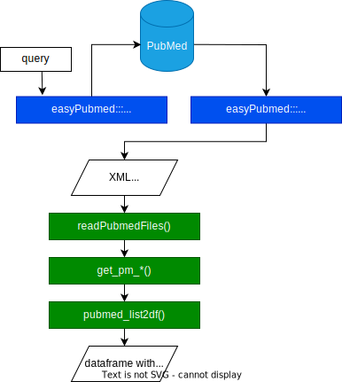

```{r, include = FALSE}
knitr::opts_chunk$set(
  collapse = TRUE,
  comment = "#>",
  cache = TRUE#, results = 'hold'
)
library(DT)
```

### Workflow

This package is designed to parse PubMed records retrieved from NCBI and convert them into data frames in R. Currently, the following data can be parsed:

* Authors
* Abstract
* Keywords
* MeSH
* Paper ID's
* Pubblication type
* Journal
* Country
* Language
* Title
* Year   

The following diagram show a straightforward way to obtain this kind of data.



The green boxes refer to the principals functions of this packages.
We can use the `easyPubMed` to retrieve the records.

## Parsing a single PubMed record
```{r setup}
library(fastpubmedxmlparser)
library(easyPubMed)
```

### Retrieving a PubMed record

```{r}
query <- 'cancer[TI] AND "2020"[dp] AND "journal article"[pt] AND "free full text"[sb] AND adolescent[mh]'

oneRecordCancer2020 <-
  get_pubmed_ids(query) |>
  fetch_pubmed_data(retmax = 1)
```

`oneRecordCancer2020` contains the PubMed record in a XML format.

### Extract data from that record

If you want to extract the data of **one** record, you can use any of the `get_pm_*` fucntions.

For example:
```{r}
oneRecordCancer2020 |>
  get_pm_title() |>
  getElement(1)
```

```{r}
oneRecordCancer2020 |>
  get_pm_abstract()|>
  getElement(1)
```

## Working with multiple records

First, we can retrieve 200 records.
```{r}
tenRecordCancer2020 <-
  get_pubmed_ids(query) |>
  fetch_pubmed_data(retmax = 200)
```

Next, we must use the `readPubmedFiles` function.
```{r}
journals <-
  tenRecordCancer2020 |>
  readPubmedFiles() |>
  get_pm_journal() |>
  pubmed_list2df() 
```

The `pubmed_list2df` will merge all the dataframes into one.

## Analysis

You can use others packages to perform additional analysis
```{r}
library(tidyverse)
```

Top 10 journals for the query:
```{r}
journals |>
  select(Title) |>
  count(Title) |>
  slice_max(n, n = 10) |>
  arrange(desc(n)) |>
  datatable()
```
